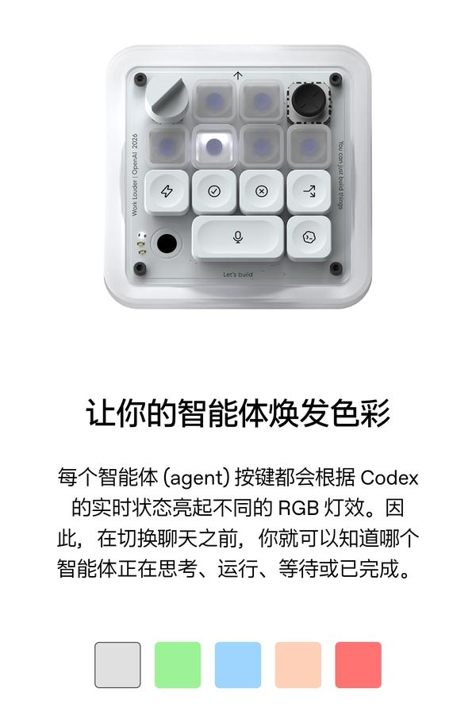
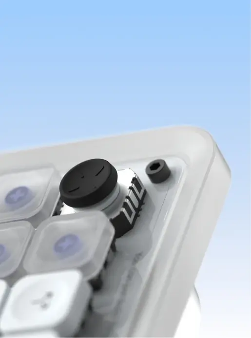
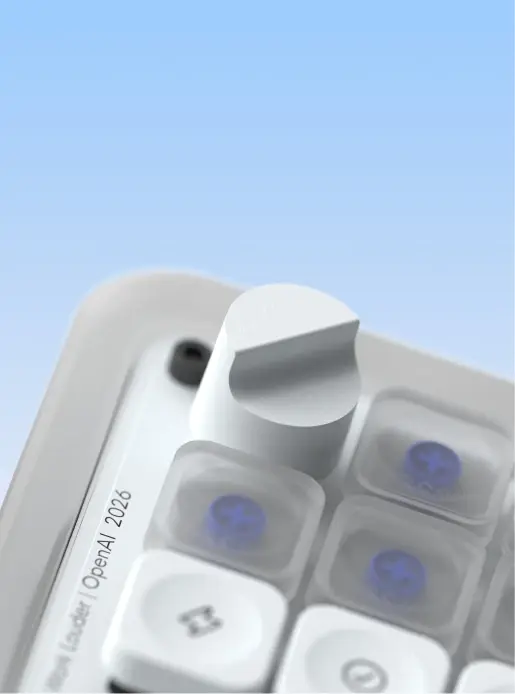
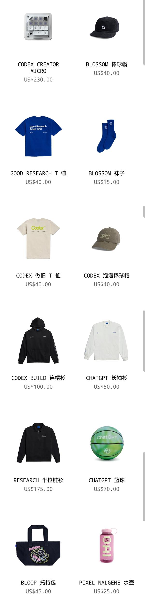

OpenAI 首款硬件发布，看起来像个华强北临时拼凑出来的众筹风，这几年众筹玩意都长这个样

名字叫做 Codex Creator Micro。看着后缀名，未来可能还有 Milli，Max，Mythos 🫥 。但更大概率是夭折，夭折才是 OpenAI 的常态。

这款硬件，看起来就是个指尖解压玩具，没有提供啥实质性的功能，不过卖得也算便宜，230 美元。

看 OpenAI 的商店，就是一股浓浓的众筹风，真不上档次。 感觉像是四季青代工衣服，义乌代工的水杯，华强北代工的硬件，设计师可能还是内部随便拉了个美工。

OpenAI 做设计真比不过 Anthropic。 Anthropic 那个平面风格与配色，在中国 UI 设计圈已经被大量复制。如果 AInthropic 来做硬件，他们应该会做个复古的打字机，或者拨轮式的电话转盘。哈哈。

