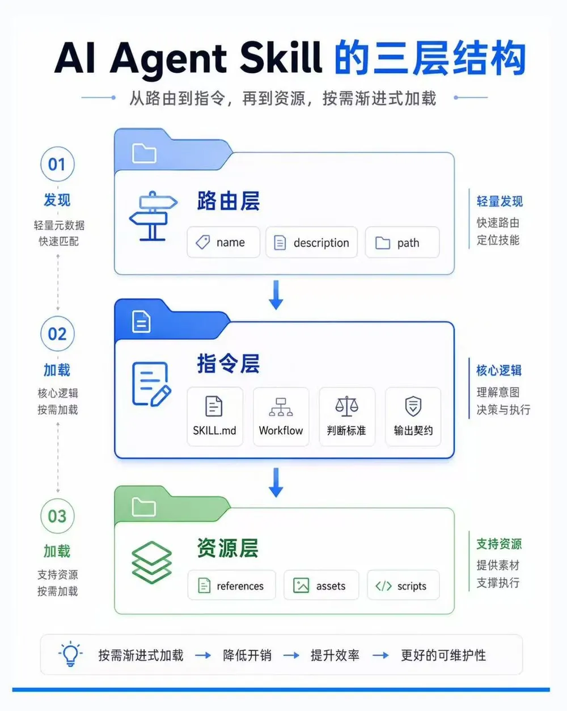
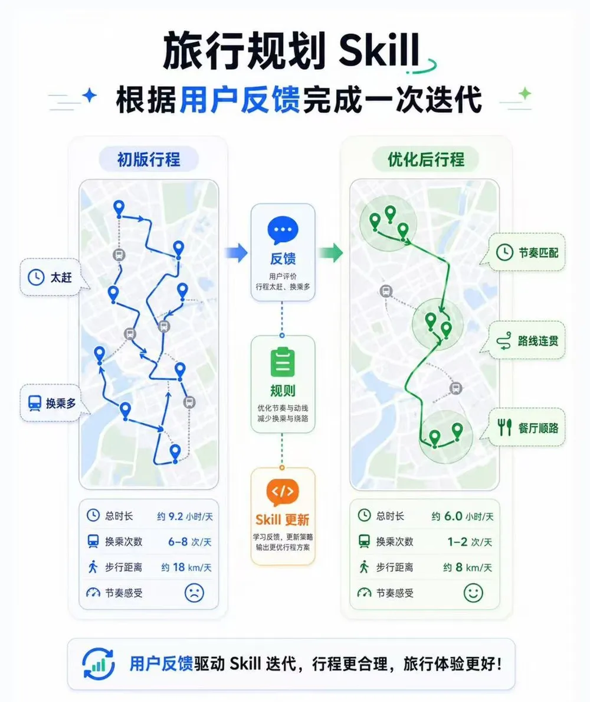
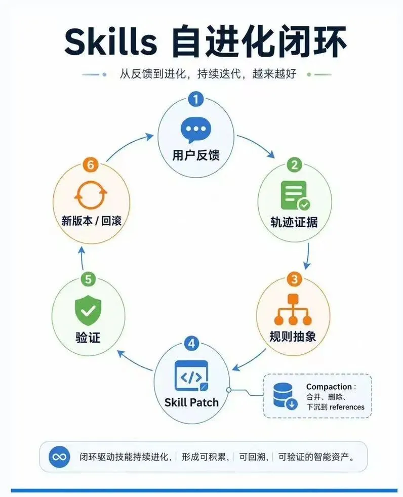

## 一、Skill 的三层结构

在 Agent 系统里，Skill 可以理解为一种可版本化的能力包。它通常以一个目录存在，核心入口是 SKILL.md。这个文件包含元信息和任务指令，也可以配合参考文档、模板、示例和脚本一起使用。按照 Agent Skills 的设计，一个 Skill 大致可以分成三层：第一层是路由层，包括 name、description 和路径，用来帮助 Agent 判断当前任务是否适合调用这个 Skill；第二层是指令层，也就是 SKILL.md 的正文，用来描述任务流程、判断标准、工具策略和输出约束；第三层是资源层，比如 references/、assets/、scripts/，用于存放更详细的文档、样例、模板或可执行代码。

这套结构对应一种渐进式加载机制。Agent 启动时先看到每个 Skill 的名字、描述和路径；当用户任务匹配某个 Skill 时，再读取完整的 SKILL.md；执行过程中如果需要更细的信息，再继续读取引用文件或运行脚本。这样，一个 Agent 可以同时拥有很多 Skills，同时保持上下文轻量。



图 1 · 一个 Skill 的三层结构与按需加载顺序
## 二、自进化：让三层结构在真实反馈中持续更新

Skills 自进化，核心是让这三层结构在真实任务反馈中持续更新。路由层可以被优化，让 Skill 的触发边界更准确；指令层可以被更新，让任务流程和判断标准更稳定；资源层可以被补充，让 Agent 在复杂场景下有示例、模板或脚本可用。每一次进化都应该能回答三个问题：改了哪一层，解决什么问题，用什么结果证明它更好。

一个例子：旅行行程规划助手

举一个中性的例子：旅行行程规划助手。最初的 travel-planner-skill v1.0 可能长这样：

```markdown
---
name: travel-planner
description: Plan a multi-day travel itinerary based on destination, dates, and user preferences.
---
## Workflow
1. Collect destination, dates, budget, and travel preferences.
2. Search for attractions, restaurants, and transportation options.
3. Arrange attractions by day.
4. Generate a day-by-day itinerary.
## Output
Use one section per day.
Include attractions, food recommendations, and transportation notes.
```

这个版本可以生成行程。比如用户说：“我想去京都玩三天，喜欢寺庙、咖啡店和轻松一点的节奏。” Agent 可能输出：

```apache
Day 1：清水寺、二年坂三年坂、八坂神社、祇园
Day 2：伏见稻荷大社、锦市场、鸭川
Day 3：金阁寺、岚山、竹林小径
```

信息看起来完整，但真实旅行体验可能不够好。第三天把金阁寺和岚山放在一起，交通时间偏长；“轻松一点”的偏好也没有真正进入安排。用户继续输入：“第三天太赶了，我不想频繁换乘，餐厅最好顺路一点。”

这些后续 prompt 会先被记录为任务轨迹的一部分，包括用户原始需求、Agent 初版方案、用户修改意见、最终采纳版本和结果评价。优化器会分析这些反馈，把一次性的表达抽象成更稳定的规则。比如“第三天太赶了”可以抽象成：当用户偏好轻松行程时，每天控制 2-3 个主要停靠点，并保留休息时间；“不想频繁换乘”可以抽象成：优先选择同一区域内的景点组合，减少跨区域移动和换乘次数；“餐厅最好顺路”可以抽象成：餐厅和休息点应尽量靠近当天路线。



图 2 · 同一次旅行规划，反馈前后的行程对比

三、把每一条反馈写到正确的一层
这些规则会进入候选修改。系统会判断它应该写到哪一层：触发边界相关的问题，修改路由层的 description；行程安排相关的问题，修改 SKILL.md 里的 Workflow；质量判断相关的问题，修改 Quality checks；亲子旅行、长辈旅行、预算旅行等细分场景，更适合放进 references/，让 Agent 在需要时按需读取。

### 改指令层：从“景点罗列”到“按区域和节奏组织”

第一次迭代可以先改 Workflow。原来是：

```markdown
2. Search for attractions, restaurants, and transportation options.
3. Arrange attractions by day.
```

候选修改变成：

```sql
2. Search for attractions, restaurants, and transportation options.
3. Group candidate places by geographic area before assigning them to days.
4. Estimate transit time between major stops.
5. Match each day's density to the user's pace preference:
    - relaxed: 2-3 major stops per day, with buffer time
    - standard: 3-4 major stops per day
    - packed: 4-6 major stops per day
```

这次改动落在指令层的任务流程。它让 Agent 在安排行程前先做区域聚类，再估算主要地点之间的交通时间，最后根据用户偏好控制每天的密度。旅行计划会从“景点罗列”变成“按区域和节奏组织”。

### 加判断标准：新增 Quality checks

接着可以改判断标准，新增一段：

```sql
## Quality checks

Before finalizing the itinerary, check:
    - Whether each day stays mostly within one geographic area.
    - Whether transit time between major stops is reasonable.
    - Whether the number of major stops matches the user's pace preference.
    - Whether meals and rest breaks are placed near the route.
```

这一步解决的是行程质量校验。Agent 生成结果前，需要自查路线是否顺、交通是否合理、餐厅和休息点是否贴近当天路线。对旅行计划来说，这类判断标准比单纯增加景点更重要。

### 下沉资源层：细分场景按需读取

如果后续发现用户经常提到“带老人小孩，少走路”，这类需求可以进入资源层。比如新增：

```bash
references/family-travel-constraints.md
```

里面写亲子或长辈出行的约束，例如减少换乘、控制步行距离、安排午休、优先选择交通便利的景点。主 SKILL.md 只保留一句触发说明：

```bash
If the user mentions children, seniors, stroller, or limited walking ability, read references/family-travel-constraints.md before finalizing the itinerary.
```

这样，主 Skill 保持轻量，细分场景放到资源层按需读取。Agent 只有在用户提到相关偏好时，才加载更细的参考内容。

## 定期做 Skill compaction：压缩与重构

随着迭代次数增加，Skill 会逐渐更详细。好的自进化系统还需要定期做 Skill compaction，也就是压缩和重构。它会检查哪些规则重复，哪些规则长期没有触发，哪些细节应该从主文件下沉到 references，哪些规则可以合并成更高层的原则。

比如主文件里原本堆了很多规则：

```diff
- 不要把距离很远的景点放在同一天
- 每天要控制景点数量
- 轻松旅行要留休息时间
- 餐厅要靠近当天路线
- 亲子旅行要减少换乘
```

经过压缩后，可以合并成一条更稳定的质量标准：

```sql
Prioritize route coherence and pace fit: keep each day geographically coherent, limit major stops according to pace, place meals and breaks near the route, and reduce transfers for family trips.
```

## 用验证决定新版本能否发布

候选 Skill 生成后，需要进入验证环节。系统可以拿一批历史旅行规划任务，让 v1.0 和 v1.1 分别生成行程，再比较几个指标：每天跨区域移动次数是否下降，平均交通时间是否减少，用户偏好是否被显式满足，行程密度是否符合预期。如果新版本表现更好，就发布为 travel-planner-skill v1.1；如果它过度保守，导致行程内容太少，这次修改会被拒绝，并记录为下一轮优化的负反馈。



图 3 · Skills 自进化的完整闭环

## 小结：从调 prompt 到持续运营 Skills

这个例子说明，Skills 自进化关注的是可定位、可验证的小步更新。用户反馈先成为证据，证据被抽象成规则，规则被写入合适的 Skill 层级，再通过验证决定是否进入新版本。随着规则积累，系统再通过压缩、合并、下沉和删除，让 Skill 保持清晰、轻量和可维护。

长期来看，Agent 的能力提升会逐渐从单次 prompt 调整，走向持续运营 Skills。模型提供通用推理能力，工具连接外部系统，Skills 承载可复用的程序性知识。真实任务中的反馈不断进入 Skill 的路由层、指令层和资源层，最终形成一套可版本管理、可评估、可回滚、可复用的能力体系。